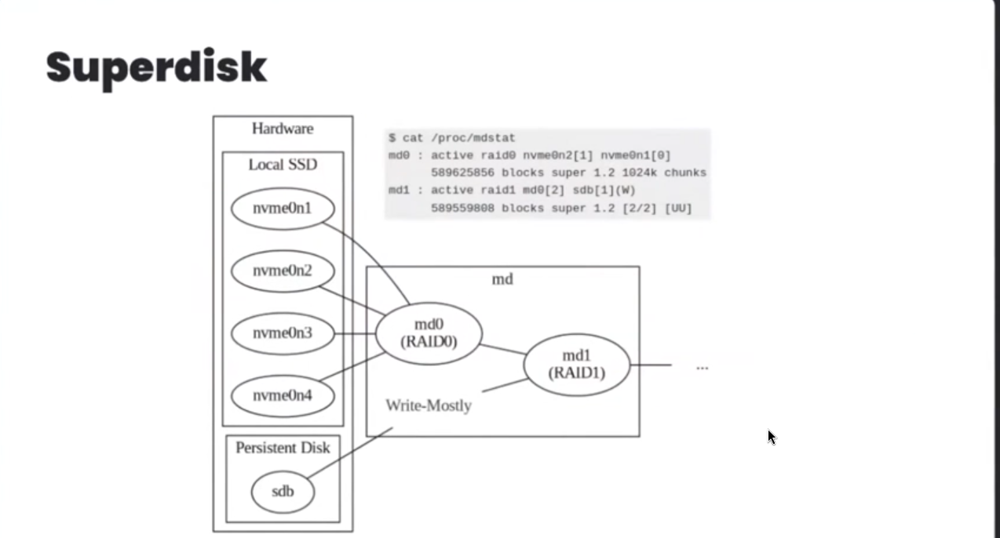

# System Design

## Reference Articles

- [System Design for Beginners - Complete Guide](https://medium.com/@shivambhadani_/system-design-for-beginners-everything-you-need-in-one-article-c74eb702540b)

## Learning Tasks

### AWS Related

- [ ] Deploy applications to AWS
- [ ] Implement Horizontal Scaling with Load Balancers
- [ ] Configure Auto-Scaling groups
- [ ] Set up CDN using AWS S3

### Caching & Messaging

- [x] Redis Cache implementation
- [x] RabbitMQ Message Queue
- [x] Redis Pub/Sub patterns
- [x] Apache Kafka

### Additional Topics

- [ ] Leader Election Algorithms
- [ ] Apache Spark
- [x] Nginx Configuration

## Other Skills

- [ ] Wireshark
- [ ] Mongodb Aggregation
- [ ] gRPC
- [ ] vim
- [ ] tmux
- [ ] Prometheus
- [ ] Datadog

## Tools and Languages

### Erlang

- Build for distributed, scalable systems
- Runs on the philosophy "let it fail", which means instead of preventing errors, it lets them occur and quickly recovers from them.
- ejabberd -> real-time messaging system server
- Used by WhatsApp

## Strategies

1. SuperDisk Strategy used by Discord, a combination of local SSD and persistent disk [ref](https://youtu.be/S2xmFOAUhsk?feature=shared&t=869)
{ width=50% }

2. [Building Models with Patterns - A Summary](https://www.mongodb.com/blog/post/building-with-patterns-a-summary)

    ESR-Rule: For a compound index to work efficiently, fields must be defined in the order:
    - E: Equality Fields which values match exactly
    - S: Sort Fields which decide the order
    - R: Range Fields on which range operations like greater than are performed

3. [Optimize Query - Mongodb explain command](https://www.mongodb.com/docs/manual/reference/method/cursor.explain/)