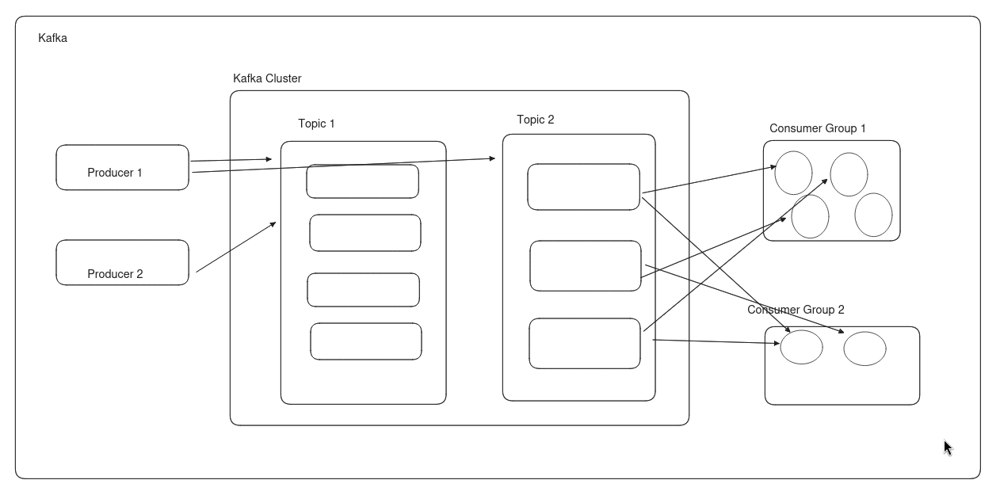
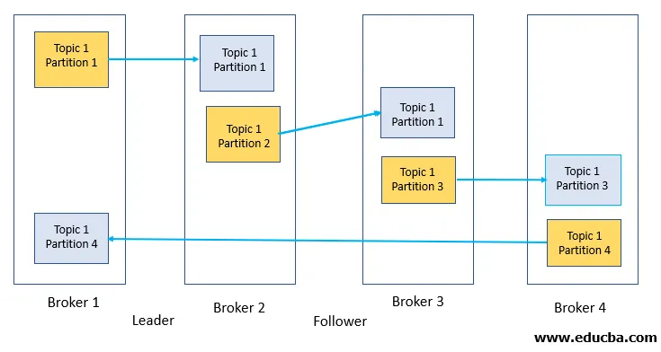

# Kafka

## Run Zookeeper
Zookeeper is depracted, kafka has now K-raft in-built
```bash
docker run -p 2181:2181 zookeeper
```

## Run Kafka
```bash
docker run -p 9092:9092 \
-e KAFKA_ZOOKEEPER_CONNECT=<PRIVATE_IP>:2181 \
-e KAFKA_ADVERTISED_LISTENERS=PLAINTEXT://<PRIVATE_IP>:9092 \
-e KAFKA_OFFSETS_TOPIC_REPLICATION_FACTOR=1 \
confluentinc/cp-kafka
```

## Run Kafka
- This image depicts Kafka from a developer's point of view.
- 

## Cluster
- A cluster consists of multiple topics.

## Topics
- Topics are channels that contain data of a specific type.
- They have multiple partitions.

## Partitions
- Partitions are subsets of topics that enable parallelism.
- For example, a topic can be divided based on streams or locations for parallel processing.

## Producers
- Producers write data to Kafka, to whichever topic they choose.

## Consumers
- Consumers read messages from Kafka.
- A consumer can handle multiple partitions, but a partition can only be consumed by one consumer within a consumer group.

## Consumer Groups
- Consumer groups are groups of consumers that share the workload across partitions.
- We can use consumer groups to process the same topic data for different purposes, such as sending location data to clients and performing analytics.

## Brokers
- Brokers are Kafka server nodes that manage some partitions of a topic distributed across the cluster.
- They are not shown in the above diagram.
- This diagram depicts the actual architecture of Kafka.
- Each node handles some partitions, and a replica is created on another broker for recovery in case of failure.
- Generally, a replication factor of 3 is recommended in production.



## Reference Articles
- [Apache Kafka: What it is and How it Works](https://medium.com/swlh/apache-kafka-what-is-and-how-it-works-e176ab31fcd5)