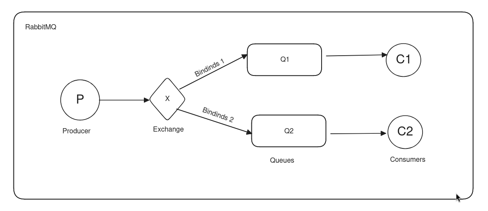

# RabbitMQ

- RabbitMQ uses AMQP - Advanced Message Queuing Protocol.
- AMQP uses binary encoding.
- AMQP is efficient, reliable, and flexible.

## Running RabbitMQ with Docker

```sh
docker run -it --rm --name rabbitmq -p 5672:5672 -p 15672:15672 rabbitmq:4.0-management-alpine
```

## RabbitMQ Architecture



## Core Concepts

### Producers

- Producers send messages to exchanges.
- To send to a particular queue, provide a routing key that specifies which queue to send to.

### Exchanges

Exchanges push messages to queues depending on the binding. There are four types of exchanges:
- **Direct**: Sends directly to the queue exactly matching the binding key with the routing key.
- **Fanout**: Sends to every queue attached to the exchange.
- **Topic**: Routes messages to one or many queues based on matching between a message routing key and the pattern used to bind a queue to an exchange. The pattern must be a list of words, delimited by dots like `<facility>.<severity>`, and pattern matching is done using `*` and `#`.
- **Headers**: Matches the headers, ignoring the routing key.

```js
channel.publish(exchangeName, queueName, Buffer.from('Hello World!'));
```

*Note: A default nameless exchange ("") is created when we directly push to a queue.*

```js
channel.sendToQueue(queueName, Buffer.from('Hello World!'));
```

### Queues

A buffer that stores messages.

### Consumers

Receives messages and processes them.

## Other Features

- **Durable**: Metadata of a durable queue is stored on disk, while metadata of a transient queue is stored in memory when possible. It does not guarantee 100% durability. (We need to mark both the queue and message as durable. We need to mark the queue as durable at both the consumer and producer. Also, we need to mark the message as persistent.)
- **TTL (Time to Live)**: Both messages and queues can have a time to live, which discards them after TTL.
- **Priority Queue**

## References

- [RabbitMQ Tutorial One - JavaScript](https://www.rabbitmq.com/tutorials/tutorial-one-javascript)
- [RabbitMQ AMQP Concepts](https://www.rabbitmq.com/tutorials/amqp-concepts)
